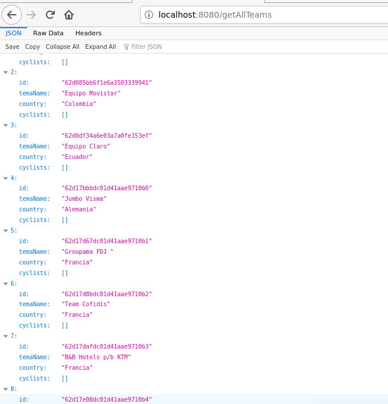
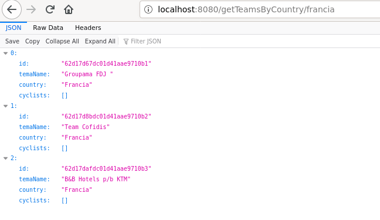
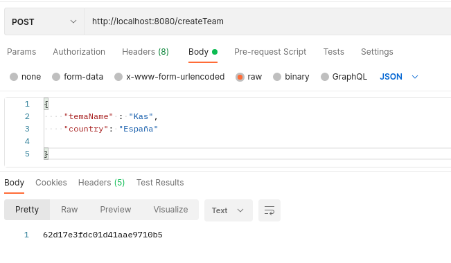
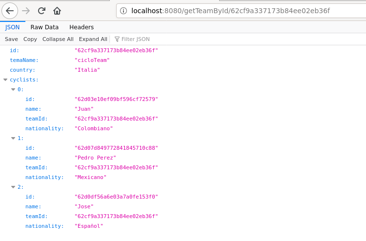
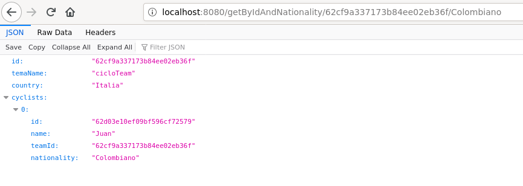
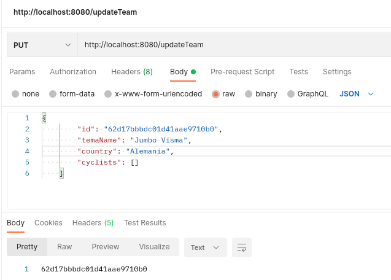
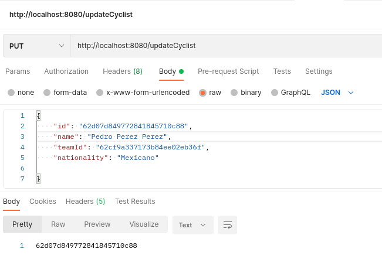

# Reto Back Zona Talentos Sofka

### Contextualización:

#### Desarrollo de aplicación  o servicio que permite el registro de los equipos y sus respectivos ciclistas para el  "Tour de Francia" tomado como caso de ejemplo.

### Tecnologías utiliadas:

#### Se crea base de datos en MongoDB Atlas/ java 11/ maven/ reactive spring boot  

### Endpoints:
#### Los endpoints se crean basándose en el diseño de las interfaces de usuario:

#### 1) En la página inicial se mostrará una tabla, la cual contiene la lista de equipos registrados, para esto  se crea el siguiente endpoint:

#### http://localhost:8080/getAllTeams

#### 2) Se tendrá la opción de filtrar por país:

####  http://localhost:8080/getTeamsByCountry/francia

#### 3) Además se tendrá la opción de crear un nuevo equipo

#### http://localhost:8080/createTeam

#### 4) Cada equipo tendrá una opción que permite ver el detalle, en el cual incluye la lista de ciclistas por equipo.

#### http://localhost:8080/getTeamById/62cf9a337173b84ee02eb36f

#### 5) En el detalle se tendrá la opción de filtrar la lista de ciclistas por nacionalidad

#### http://localhost:8080/getByIdAndNationality/62cf9a337173b84ee02eb36f/Colombiano

#### 6) Además se tendá la opción de editar el equipo
#### http://localhost:8080/updateTeam

#### 7) En la lista de ciclista se tiene la opción de editar el registro de cada ciclista

#### http://localhost:8080/updateCyclist

#### Nota: Para el modelo se utiliza una arquitectura por capas internas, donde la capa de presentación corresponde a los routers, la de negocio a los casos de uso y la capa de infraestructura corresponde a los repositorios.

